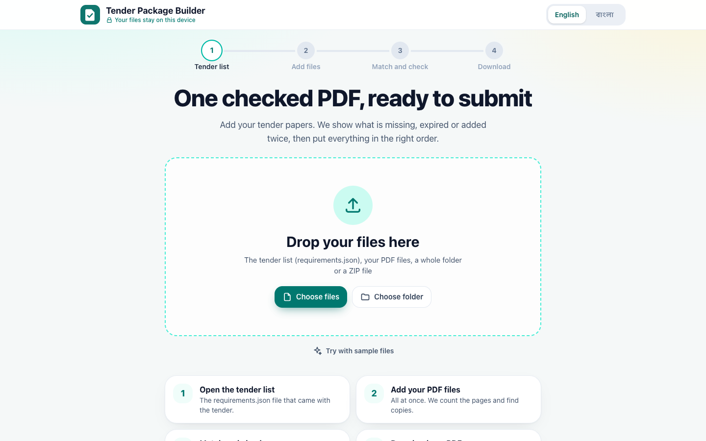
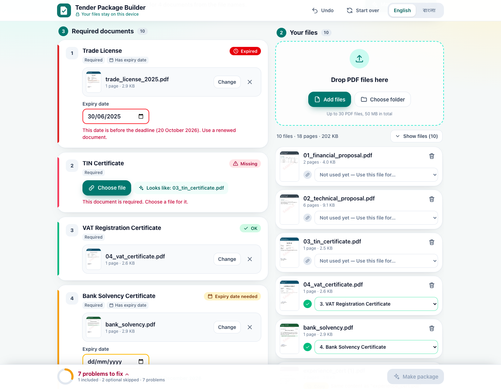
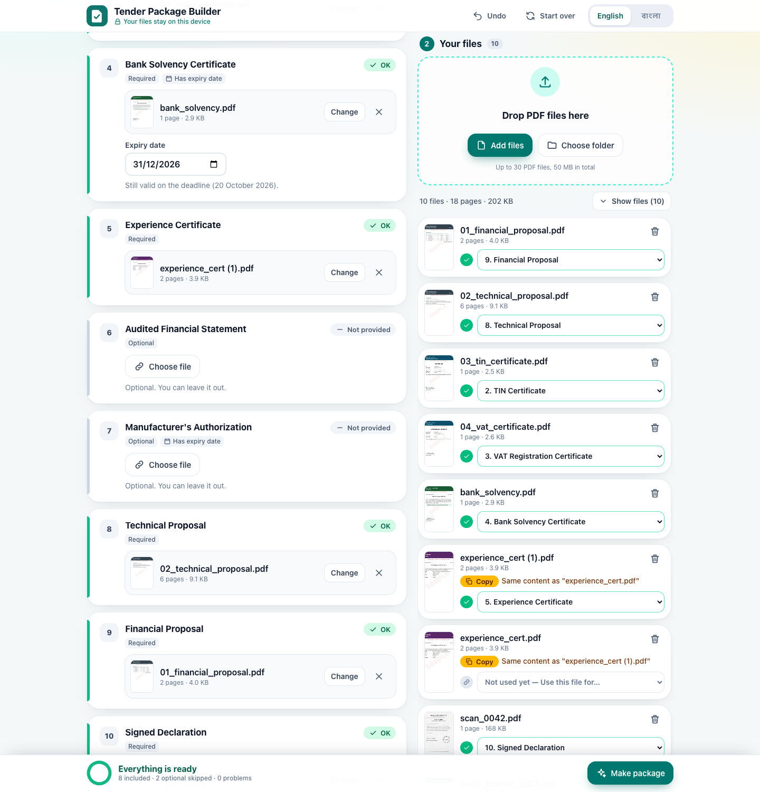
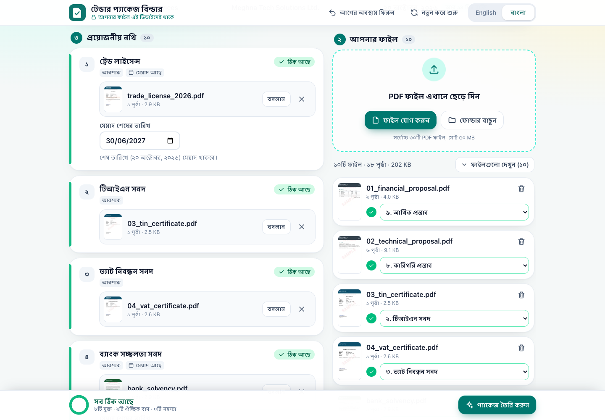
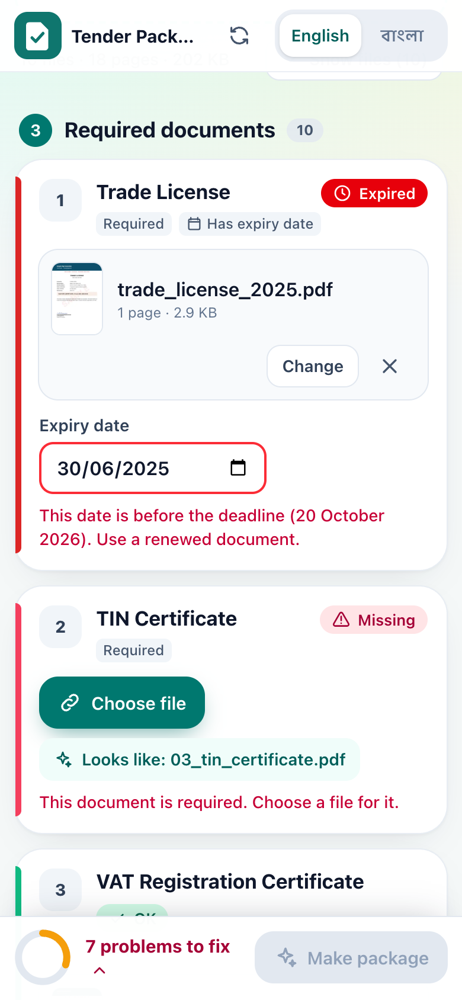
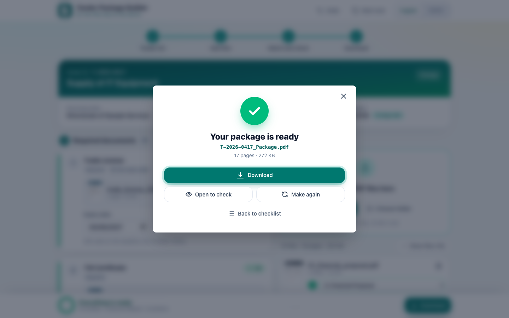

# Tender Package Builder

**Turn a pile of tender PDFs into one checked, correctly ordered package, ready to submit. In the browser, in Bangla or English, with no server.**

Built for the AI DevFest *Vibe Coding* contest (problem: *Tender Document Package Builder*).

| | |
| --- | --- |
| **Live site** | https://md-irfanur-islam-rahat.vercel.app |
| **Source code** | https://github.com/irfan0072/MD-Irfanur-Islam-Rahat |
| **Final package from the sample pack** | [`output/T-2026-0417_Package.pdf`](output/T-2026-0417_Package.pdf) |



*The start screen: drop everything at once, or press "Try with sample files".*

---

## What problem does it solve?

When a company bids for a tender, it must hand in a fixed set of documents (trade license, TIN and VAT certificates, bank solvency letter, experience certificates, proposals, and so on). Some are mandatory, some optional, some must still be valid on the submission date, and they must appear in the order the tender states. In many offices this is done by hand, and one missing, expired, duplicated or misplaced paper can get the bid rejected.

This app does that checking for office staff:

1. The user opens the tender's `requirements.json` and adds the PDF files.
2. The user matches each file to a required document. The app suggests matches, and one file can serve only one document.
3. The app shows exactly one status for every required document (Missing, Expiry date needed, Expired, Not provided, OK) and updates it after every change.
4. When nothing blocks, one button builds a single PDF: an English cover page, the documents in tender order, and a `<tender_id> | Page X of Y` footer on every page.

Everything runs in the browser. PDFs are never uploaded anywhere by the app (the only exception is the optional AI help, which sends parts of the documents to the AI provider the user picks, and only when the user starts it; see [AI help and privacy](#ai-help-and-privacy)).

---

## Website preview

All images below were captured from the built app (`npm run build` and `npm run preview`) using only the fictional sample pack, by [`scripts/readme-shots.mjs`](scripts/readme-shots.mjs).

### Document statuses with problems

Four different statuses at once: **Expired** (old trade license, date before the deadline), **Missing** (TIN certificate has no file), **OK**, and **Expiry date needed** (bank letter has no date yet). The bottom bar says "7 problems to fix" and **Make package** is disabled.



### Resolved checklist

After the renewed license is used, dates are entered and the scanned declaration is matched, every required document is **OK**, the two optional documents are **Not provided**, and **Make package** is enabled. The image shows documents 4 to 10 and the file list beside them.



### Bangla interface

The whole app switches to Bangla, including statuses, dates, digits and the summary line.



### Phone layout

Same blocked state as above on a 390 px wide screen. On phones and tablets the file list folds away and a "Go to required documents" button jumps to the statuses.



### Package ready



*Shown after pressing "Make package" on the resolved sample pack.*

---

## Quick start

Needs Node.js and npm. The project was built and tested with Node 20.

```bash
git clone https://github.com/irfan0072/MD-Irfanur-Islam-Rahat.git
cd MD-Irfanur-Islam-Rahat
npm install
npm run build      # type-check, then production build into dist/
npm run preview    # serves the build at http://localhost:4173
```

Open http://localhost:4173 in Chrome and press **Try with sample files**. That loads the fictional sample pack that ships in [`public/sample/`](public/sample/).

| Command | What it does |
| --- | --- |
| `npm run dev` | Vite development server (prints its address; Vite's default is port 5173) |
| `npm run build` | `tsc --noEmit`, then `vite build` into `dist/` |
| `npm run preview` | Serves `dist/` on port 4173 |
| `npm run e2e` | Browser test against the preview server (see [Validation](#validation-and-limitations)) |
| `node scripts/seal-test.mjs`, `ai-test.mjs`, `stress-test.mjs` | Further checks: seal rules, AI help with simulated answers, limits and awkward input |
| `node scripts/readme-shots.mjs` | Re-captures the README screenshots (preview server must be running) |

`dist/` is a plain static site with relative paths, so it also works on any static host.

---

## How to use it

1. **Open the tender list and the files.** Drop `requirements.json` and the PDFs together (or a whole folder, or a ZIP file) on the page, or use **Choose files** / **Choose folder**. The tender card (ID, title, entity, bidder, deadline) and the document list appear.
2. **Check the files.** Each file card shows its name, page count and size. Anything that is not a valid PDF is refused with a message. Exact copies are marked **Copy**.
3. **Match files to documents.** Press **Match automatically** for suggestions, or use **Choose file** on a document, the drop-down on a file card, or drag a file onto a document. **Change** or the cross removes a match, and **Undo** in the header steps back.
4. **Enter expiry dates.** Documents with an expiry show a date field once a file is matched. If the PDF text says "valid until ...", a button offers that date.
5. **Resolve blockers.** The bottom bar counts problems; tap it for the list and press **Fix** to jump to a document.
6. **Make the package.** When nothing blocks, press **Make package**, then **Download**. The file is named `<tender_id>_Package.pdf`.

The **English / বাংলা** switch in the header changes the whole app at any time.

---

## Main requirements (problem statement section 4)

| Task | How it is implemented |
| --- | --- |
| **4.1** Load the list | `requirements.json` is read in the browser; tender details are shown and documents are sorted by `order` (whatever order the file lists them in). A list with a missing tender ID or a deadline that is not a real calendar date (for example `2026-02-31`) is refused with a message and the open project is left unchanged. |
| **4.2** Upload files | Many files at once; name, page count and size on each card; a remove button on each. A file is accepted only if it has a PDF header, whatever its name says; other files get a clear message. Locked and damaged PDFs get their own messages. |
| **4.3** Match files | One file per document and one document per file. Choosing a file that is already used elsewhere moves it. Matches can be changed, removed and undone (**Undo** steps back through recent changes). |
| **4.4** Expiry dates | A date field appears on every matched document with `has_expiry = true`. |
| **4.5** Check everything | One status per document, recalculated after every change. |
| **4.6** Duplicates | Files are compared by the SHA-256 hash of their bytes, so renamed copies are found. Copies are marked, and a copy cannot be matched to a second document (its option is disabled, with an explanation). |
| **4.7** Make the package | **Make package** is disabled while any document blocks. The reason is shown as a list with a **Fix** button for each item. |
| **4.8** Download | `<tender_id>_Package.pdf`. Characters that are not safe in file names are replaced by `-` (for example `DPHE/2026/W-88` becomes `DPHE-2026-W-88_Package.pdf`). |
| **4.9** Two languages | Whole interface in Bangla or English; document names come from `title_bn` or `title_en`. Tender title, entity and bidder are shown as written in the JSON. |

---

## Status rules (section 5)

Every required document shows exactly one status.

| Status | When | Blocks the package? |
| --- | --- | --- |
| **Missing** | Mandatory document, no file matched | Yes |
| **Expiry date needed** | `has_expiry` is true, a file is matched, no date entered | Yes |
| **Expired** | Expiry date is before the submission deadline | Yes |
| **Not provided** | Optional document, no file matched | No |
| **OK** | File matched and, if `has_expiry`, the date is on or after the deadline | No |

- **Expiry on the same day as the deadline is OK.** One day earlier is Expired.
- An optional document that has a file matched but no date, and `has_expiry` true, shows **Expiry date needed** and blocks, because it is no longer unmatched.
- The expiry date belongs to the file, so it follows the file if the match changes.

---

## The generated PDF (section 6)

| Rule | What the app does |
| --- | --- |
| **Cover page (6.1)** | Page 1, in English: tender ID, title, procuring entity, bidder, submission deadline, the date the package was made, and the list of included documents in order with their page counts. Text the built-in PDF font cannot write (for example a Bangla tender title) is drawn by the browser as a picture, so it still displays correctly. |
| **Order and pages (6.2)** | Documents follow the cover sorted by `order`, with every page of every file in its original order. Optional documents without a file are skipped. |
| **Footer (6.3)** | Every page, cover included, ends with `<tender_id> \| Page X of Y`, where Y is the total page count of the package. |
| **Footer never covers content (6.4)** | Each document page is made slightly taller: a white strip is added at its visible bottom edge and the footer is written in that strip. The original page is not scaled, moved or drawn over, so full-page scans and landscape or rotated pages are handled as well. |

### Optional index page

The *Add an index page* switch under **More options** puts one extra page after the cover. It lists each document in English and Bangla, with the page it starts on and its page range. **It is on by default**, and then the package is cover, index, documents, and the footer counts the index page in `Y`. Switch it off for a strict "cover, then documents" package.

---

## Traps in the sample pack and how the app handles them

| Trap | What happens |
| --- | --- |
| `company_logo.png` is not a PDF | Refused with "This is not a PDF file", and offered as a seal image instead. |
| `experience_cert.pdf` and `experience_cert (1).pdf` have identical content | Both marked **Copy**. Only one can be used, and the other cannot be matched to another document. |
| `trade_license_2025.pdf` expired on 2025-06-30; `trade_license_2026.pdf` is valid to 2027-06-30 | The old one shows **Expired** and blocks. Automatic matching prefers the renewed one. |
| `scan_0042.pdf` is an image-only scan with a meaningless name (it is the signed declaration) | Not guessed. The user opens the preview and matches it to *Signed Declaration* by hand. |
| Number prefixes `01_financial...` and `02_technical...` do not follow the tender order | Order always comes from `requirements.json`, never from file names. |
| No file for *Audited Financial Statement* and *Manufacturer's Authorization* | **Not provided**. Skipped in the package. |

The app logic does not depend on these file names or this tender (only the "Try with sample files" button knows them), because the app must also work on a pack it has not seen.

---

## Bonus features

| Feature | Implemented as | Checked |
| --- | --- | --- |
| **Index page** | Optional page after the cover (see above) | Browser test: present, and its start pages match where the documents begin. Off: checked in the stress test (4-page package). |
| **Bangla on the index** | Bangla document names are drawn by the browser so conjuncts and vowel signs are correct | Rendered and viewed (index page) |
| **Seal or signature** | Upload a PNG or JPEG; place it on the cover, the last page of each document, every page, or a page list (`1, 3-5`, `1 - 3`, `১, ৩-৫`); six positions; adjustable size. A damaged picture is refused when it is chosen. An empty, malformed or out-of-range page list is refused with the reason and **blocks the package**, so a package is never made without the seal that was asked for. The seal keeps its proportions, always fits inside the page and stays clear of the footer. | `scripts/seal-test.mjs`: 58 checks, including 27 packages built from portrait, landscape, small and rotated pages with square, very wide and very tall seals, read back to confirm page, position and proportions. Browser test: refusal messages and seal pages in the built PDF. Two sealed pages viewed by eye. |
| **Checklist export** | CSV (opens in Excel): No., document, required, file name, pages, expiry date, status, in the language on screen. Named `<tender_id>_Checklist.csv`. | Downloaded in English and Bangla and parsed field by field, including titles and file names with commas, quotes, a line break and Bangla |
| **Save and reopen** | Work (files, matches, dates, index and seal settings) is kept in the browser's IndexedDB and restored on the next visit. **Start over** erases it. If the browser cannot save (storage full or blocked) a standing warning is shown and the app keeps working. There is no project-file export. | Reload checked with 10 and with 29 files, index off and seal settings; failing and blocked storage simulated |
| **Auto-match** | Scores file names and the first-page text against the document titles, prefers still-valid documents, keeps one file per document and skips exact copies | Browser test on the sample pack |
| **Bad files** | Locked, damaged, empty and non-PDF files each get a message; the app keeps working | Stress test (damaged, locked, text named `.pdf`) |
| **AI help** | Optional, with the user's own key; three providers (see below) | Requests, key handling and every error path checked with simulated answers. **No real key was available, so a real model's answer is unverified.** |

Also included: a themed start screen while saved work is restored, Undo, drag and drop between the file list and documents, ZIP and folder import, and keyboard-friendly dialogs.

---

## AI help and privacy

AI help is optional. Matching, validation and building the PDF all work without it and without any key.

### Models

| Group | Model | Provider | Model ID sent |
| --- | --- | --- | --- |
| Standard (default) | Gemini 2.5 Flash | Google | `gemini-2.5-flash` |
| Standard | GPT-4o | OpenAI | `gpt-4o` |
| Advanced models | Gemini 3.8 Flash | Google | `gemini-3.8-flash` |
| Advanced models | Claude Sonnet 5.5 | Anthropic | `claude-sonnet-5-5` |
| Advanced models | Claude Opus 5.5 | Anthropic | `claude-opus-5-5` |

Model IDs were checked against each provider's documentation on 6 October 2026. Google's page says Gemini 2.5 models are now offered only to accounts that used them before, so a new Google key may be refused for the default model; the app says so next to the picker and points to Gemini 3.8 Flash.

### How it behaves

- The user picks a model, pastes **their own key for that provider**, and presses **Ask AI**. The provider and model are named on screen before sending.
- **Nothing is sent before that button is pressed.** Choosing a model or typing a key makes no request.
- **Only the chosen provider and model are called.** If the request fails or is declined, the app shows the reason and stops. It never switches to another provider or model.
- A request is cancelled after 90 seconds.
- The answer only fills documents that have no match yet and dates that have not been typed. Hand-made matches and typed dates are not touched, duplicate prevention still applies, unusable entries in the answer are ignored one by one, and the result can be undone. Dates filled this way are marked "Read from the file. Please check it."
- Wrong key, unavailable model, rate limit, no connection, timeout, a declined request and an unreadable answer each have their own message in English and Bangla, and in each case nothing is changed.

### What is sent, and where

The browser sends the request directly to the chosen provider (Google `generativelanguage.googleapis.com`, OpenAI `api.openai.com`, or Anthropic `api.anthropic.com`). No server of this project is involved. The request contains:

- the tender title, ID and deadline, and each required document's ID, English and Bangla title and whether it has an expiry;
- for each file: its name, page count and the text of its first (up to three) pages, capped at 6,000 characters;
- for a file with no readable text (a scan), a JPEG of its first page.

Other pages and the rest of the file content are not sent. Using it may cost money on the user's account with that provider. For OpenAI the request asks that the response is not stored (`store: false`).

### Keys

One key field per provider. Keys are kept in the browser tab's `sessionStorage` only: not in the saved project, not in IndexedDB, not in any download, and never bundled in the app. They disappear when the tab is closed. Each request carries only the key of the provider it goes to.

### Local versus external

Reading PDFs, page counts, previews, duplicate detection, automatic matching, date hints, validation and building the PDF all happen in the browser. During a session without AI, the browser's requests go only to the site's own origin, plus inline `data:` URLs (checked on one full run of the sample pack, switching to Bangla, through to the finished package).

**Browser storage.** Saved work includes the PDF bytes, kept in IndexedDB on that device until **Start over** is pressed. On a shared computer, press **Start over** when finished.

---

## Limits and compatibility

- **Up to 30 PDF files and 50 MB in total** (the tender list does not count). Extra files are refused with a message (`MAX_FILES` and `MAX_BYTES` in [`src/store.ts`](src/store.ts)).
- **Google Chrome** is the target browser. The app was exercised in a headless Chromium build, **Chrome for Testing 153.0.8010.12**, through `puppeteer-core`. The Google Chrome application itself was not installed on the development machine, so **retail Google Chrome was not used for verification**, and other browsers were not tested.
- Duplicate detection uses `crypto.subtle` (SHA-256), which browsers allow on HTTPS and `localhost`. On a plain `http://` address it falls back to a weaker fingerprint.
- Long titles and file names wrap inside their cards; checked at 1440, 768, 390 and 320 px with 29 files.
- The PDF cover is English only, as the problem statement requires. The interface text in Bangla was written with an AI assistant and has not been reviewed by a native speaker.

---

## Validation and limitations

### Checks that were run

All four scripts below passed on the last run, in a headless Chromium build (Chrome for Testing 153).

| Script | Checks | What it covers |
| --- | --- | --- |
| `npm run e2e` | 97 | The sample pack end to end: document order, page counts, non-PDF refusal, duplicates, every status rule (expiry one day before, on, and after the deadline), copy blocking, removing a match, keyboard use of the dialogs, refusal of bad deadlines, Bangla, the start screen, seal refusals and page lists, PDF and CSV downloads (names, bytes, every CSV field in both languages), reload with saved work, and layouts at 768, 390 and 320 px. It reads the package back page by page: 17 pages, cover fields, optional documents absent, document order, index start pages, `T-2026-0417 \| Page X of 17` on all 17 pages, and the seal on exactly the pages asked for. |
| `node scripts/seal-test.mjs` | 58 | Page-list parsing (27 inputs), placement maths (450 combinations), and 27 real packages with extreme seal shapes on portrait, landscape, small and rotated pages. No browser needed. |
| `node scripts/ai-test.mjs` | 67 | AI help with **simulated** provider answers: no request on model or key changes, one request to the right host with only that provider's key, what is sent, a good answer applied, hand-made work protected, Undo, and seven failure kinds per provider with nothing changed and no other provider or model tried. With `LIVE=1` it also sends one request per provider with a made-up key: all three real services were reached from the browser and refused it with the right message. |
| `node scripts/stress-test.mjs` | 27 | Files made on the spot: 30 files accepted and the 31st refused, a 51 MB file refused, damaged and locked PDFs, a renamed copy, long and awkward titles and file names at 1440, 768, 390 and 320 px, CSV with commas, quotes, a line break and Bangla, settings after reload, a package with the index off and a seal on last pages, and browser storage that is full or blocked. |

Also:

- **Viewed by eye:** cover, index and last (scanned) page of the sample package; two sealed test pages (a very tall seal on a rotated page, a very wide seal on a small page); the screenshots above and those in `screenshots/qa/`.
- **Independent QA passes** (a separate tool, on earlier builds) covering the sample workflow and the bonus features. Their findings were fixed and are now covered by the scripts above. Those passes were not repeated on the latest build.

Run them yourself:

```bash
npm run build
npm run preview              # leave running in one terminal
npm run e2e                  # in another terminal
node scripts/seal-test.mjs
node scripts/ai-test.mjs     # add LIVE=1 to also send the made-up-key requests
node scripts/stress-test.mjs
```

`npm run e2e` reads the contest sample pack from `docs/sample-pack/` (that folder is not committed; copy the pack there) and **rewrites** `output/T-2026-0417_Package.pdf` and `screenshots/qa/`. The browser scripts look for Chrome in the usual macOS places; set `CHROME=/path/to/chrome` elsewhere.

### Material gaps

- Not verified in retail Google Chrome (see above).
- **AI help has not been run with a real key for any provider.** The request format follows each provider's documentation and the browser can reach all three services, but whether a real model accepts the request and answers well is unverified. A real 90-second timeout was not waited for.
- The default AI model, Gemini 2.5 Flash, may be refused for new Google accounts (see above).
- Not automated: dragging files from the operating system, the system folder chooser, and folder recursion.
- Sealed pages were checked by reading the PDF back; only two of them were looked at as pictures.
- Not tested: the exact 50 MB boundary, concurrent actions, and a full colour-contrast accessibility audit.
- There are no unit tests for the interface, only the scripts above.
- The official contest rulebook was not available while building, so compliance with rules that appear only there is unchecked.
- Undo restores matches and dates but does not bring back a file that was removed.
- Bad files that arrive after 30 files are already loaded are refused for the limit, not for their own fault.

---

## Submission artifacts

| Artifact | Status |
| --- | --- |
| Public GitHub repository | https://github.com/irfan0072/MD-Irfanur-Islam-Rahat (public when checked) |
| Public HTTPS deployment | https://md-irfanur-islam-rahat.vercel.app (reachable, HTTP 200, when checked; it shows what was last pushed) |
| `output/<tender_id>_Package.pdf` | [`output/T-2026-0417_Package.pdf`](output/T-2026-0417_Package.pdf): made by the app from the sample pack after resolving its problems. 17 pages: cover, index, 15 document pages. |
| `screenshots/` with a statuses screenshot | [`02-statuses-blocked.png`](screenshots/02-statuses-blocked.png) and [`03-checklist-resolved.png`](screenshots/03-checklist-resolved.png) show document statuses; the other README images are in the same folder. [`screenshots/qa/`](screenshots/qa/) holds the screenshots written by the browser test. |
| GitHub Pages workflow | [`.github/workflows/deploy.yml`](.github/workflows/deploy.yml) is included, but GitHub Pages is not enabled for the repository, so its runs show as failed. The live site is the Vercel one. |

---

## Technology

| Part | Choice |
| --- | --- |
| UI | [Preact](https://preactjs.com) 10, TypeScript 5 |
| Build | [Vite](https://vite.dev) 6 |
| Styling | [Tailwind CSS](https://tailwindcss.com) 4; Bangla font [Hind Siliguri](https://fontsource.org/fonts/hind-siliguri) via `@fontsource` |
| Build the PDF | [pdf-lib](https://pdf-lib.js.org) 1.17 |
| Page counts, previews, text | [pdf.js](https://mozilla.github.io/pdf.js/) (`pdfjs-dist` 4) |
| ZIP import | [fflate](https://github.com/101arrowz/fflate) |
| Optional AI | Google and OpenAI through plain `fetch`; Anthropic through [`@anthropic-ai/sdk`](https://github.com/anthropics/anthropic-sdk-typescript), loaded only when a Claude model is asked |
| Browser test | `puppeteer-core` (development only) |

**Speed.** On first load the browser downloads about **41 kB of JavaScript and 10 kB of CSS (gzip)**, measured from `dist/`. The PDF libraries are loaded on demand: pdf-lib when the first PDF is added, pdf.js in the background after files are listed. A small inline start screen shows immediately while saved work is restored.

### Project structure

```
index.html               start screen (inline HTML and CSS) and page shell
src/
  app.tsx                main screens: header, landing, requirement and file cards, bottom bar
  panels.tsx             dialogs (picker, preview, package ready) and "More options"
  store.ts               state, status rules, duplicates, intake, persistence, CSV, AI call site
  i18n.ts                Bangla and English texts, number and date formatting
  lib/build.ts           package builder (cover, index, footer strip, seal)
  lib/match.ts           auto-match and expiry-date hints
  lib/pdf.ts             PDF checks, page counts, SHA-256
  lib/preview.ts         thumbnails, previews, text extraction (pdf.js)
  lib/textimg.ts         browser-drawn text for Bangla in the PDF
  lib/ai.ts              optional AI request (Google, OpenAI, Anthropic)
public/sample/           fictional sample pack used by "Try with sample files"
scripts/                 e2e.mjs, seal-test.mjs, ai-test.mjs, stress-test.mjs (checks), readme-shots.mjs, render.mjs
output/                  T-2026-0417_Package.pdf
screenshots/             README images; qa/ holds browser test screenshots
.github/workflows/       GitHub Pages workflow (Pages is not enabled)
```

---

## Author
# MD-Irfanur-Islam-Rahat
**Name:** MD Irfanur Islam Rahat  
**GitHub:** [irfan0072](https://github.com/irfan0072)  
**Registration No.:** 251-15-857
